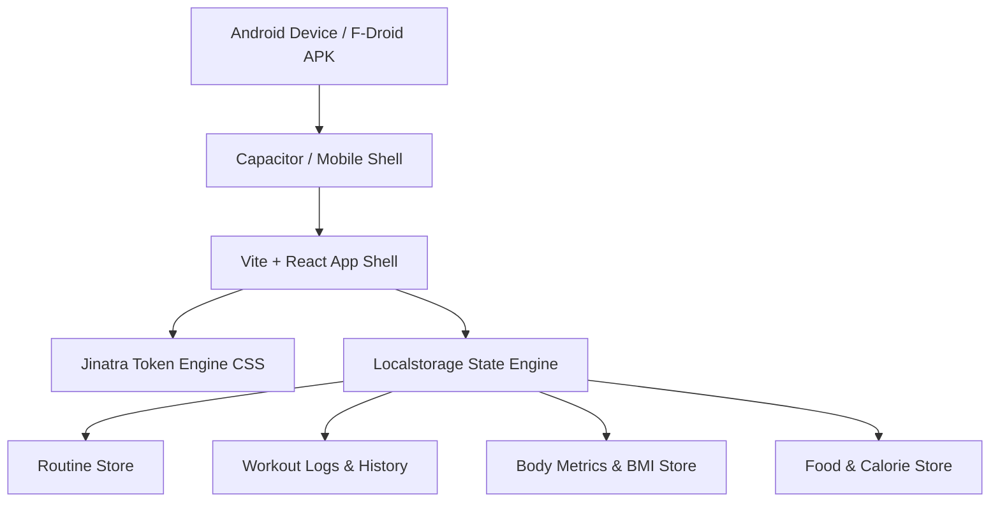

# PRD & Implementation Plan — Jinatra Neubrutalist Training App (Android APK)

## 1. Product Overview & Vision
**Product Name Candidate**: **jinatra iron** (or one of the 10 proposed brand names below)  
**Parent Brand System**: **Jinatra Neubrutalist Product System v1.1**  
**Target Platform**: Android APK (F-Droid & local installation ready; localstorage-first architecture with offline persistence).  
**Design Direction**: Industrial Neubrutalism strictly adhering to Jinatra Brand Guidelines v1.1 (`#FFEACF` Sweet Cream canvas, `#0A756C` Deep Teal primary action, `#1A1A1A` 3px Ink borders & zero-blur 6px/3px hard shadows, `#FF6B35` Signal single highlight, Archivo + Inter + JetBrains Mono typography, 0px border radius).

---

## 2. Key Features & Requirements

### A. Routine & Exercise Builder (Custom Routines Only)
- **Zero Pre-filled Bloat**: Starts as a clean slate (blank workspace), allowing users to construct their own custom workout splits.
- **Custom Split Builder**: Create, rename, edit, and delete training routines (e.g. 5-Day Push/Pull/Legs, Upper/Lower, 3-Day Full Body).
- **Day & Exercise Manager**:
  - Add custom days (e.g. Saturday Push, Sunday Pull) with day tags.
  - Structure exercises with target sets, target reps, rest time duration, and YouTube video link attachments for form guides.
  - Custom Warm-up & Finisher sections per training day.

### B. Live Workout Execution & Rest Timer
- **Interactive Workout Player**: Real-time mode when starting a workout session.
- **Set Completion Checkboxes**: Check off sets as completed with instant active tactile press feedback (`transform: translate(3px, 3px)`).
- **Weight & Rep Logger**: Record actual weight (kg/lbs) and reps performed per set for progressive overload tracking.
- **Neubrutalist Rest Timer**: Integrated countdown timer (30s, 60s, 90s, custom) with JetBrains Mono display, visual Signal warning ring, and audio/vibration notification on completion.

### C. Accountability System & Missed Workout Tracking
- **Streak & Consistency Tracker**: Visual streak counter showing consecutive active training weeks.
- **Missed Workout Alerts**: Highlights missed days on the schedule with Signal orange status tags and accountability prompts.

### D. Nutrition & Calorie Logger
- **Food & Calorie Entry**: Log daily meal items, calorie counts, and macro breakdown (Protein, Carbs, Fat).
- **Daily Calorie Target Bar**: Visual progress bar showing remaining calories for the day vs. target.
- **Calories Burned Calculator**: Track estimated workout energy expenditure.

### E. Body & Health Metrics Tracker
- **Body Weight Logger**: Log daily/weekly body weight with date stamps.
- **BMI Calculator**: Automatic BMI calculation and health category classification using user height and weight.
- **Body Progress History**: Tabular & visual log of weight changes over time.

### F. Calendar & Training Log History
- **Interactive Training Calendar**: Grid calendar highlighting completed workouts, rest days, and missed workouts.
- **Workout Detail Archive**: Tap any past date to view full exercise sets, total volume lifted, and workout duration.

---

## 3. Brand Naming Proposals (Jinatra Ecosystem)

Following the Jinatra brand voice (*direct, warm, confident, plain verbs, lowercase wordmark*):

1. **jinatra iron** — Strong, grounded, structural. Pure strength training focus.
2. **jinatra forged** — Craftsmanship and physical transformation made visible.
3. **jinatra reps** — Action-oriented, direct, no-nonsense workout logging.
4. **jinatra slab** — Bold nod to the Neubrutalist square slab design system.
5. **jinatra pulse** — Rhythmic, energy-driven, combining cardio, calories, and lifts.
6. **jinatra frame** — Structural, clear boundaries for building workout routines.
7. **jinatra heavy** — Confident weightlifting companion.
8. **jinatra stride** — Progress, consistency, and daily discipline.
9. **jinatra track** — Direct, high-utility performance tracking.
10. **jinatra brutal** — Unapologetically bold industrial training logger.

---

## 4. Architecture & Technical Handoff Plan

### File Structure Strategy
- `src/styles/jinatra.tokens.css`: Core Jinatra v1.1 design tokens (`--jn-cream`, `--jn-teal`, `--jn-ink`, `--jn-signal`, `--jn-paper`, `--jn-mist`, Archivo, Inter, JetBrains Mono).
- `src/components/Navigation.jsx`: Neubrutalist 5-Tab Bottom Navigation Bar.
- `src/components/Routines/`: Custom routine builder, exercise editor, warm-up/finisher manager.
- `src/components/LiveWorkout/`: Active workout player, set checkboxes, rest timer player.
- `src/components/Nutrition/`: Calorie logger & macro tracker.
- `src/components/BodyTracker/`: Weight log & BMI calculator.
- `src/components/Calendar/`: Calendar view & accountability log.
- `src/services/storage.js`: Robust LocalStorage manager with JSON export/import for F-Droid users.

---

## 5. Verification & Quality Floor Plan
- Mobile responsive layout check (360px to 430px Android screen widths).
- 0px border-radius audit (strictly 0px across all slabs, cards, buttons, inputs).
- Contrast ratio audit (Ink on Cream 14:1, Teal on Cream 4.7:1).
- Tactile button press animation check (`transform: translate(3px,3px)`, zero-blur shadow collapse).
- F-Droid APK build verification using Android tooling.
